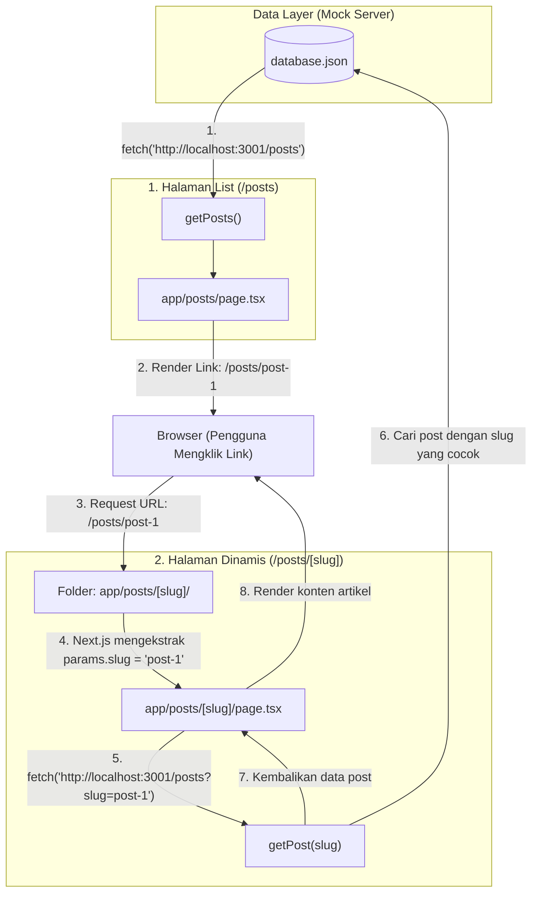
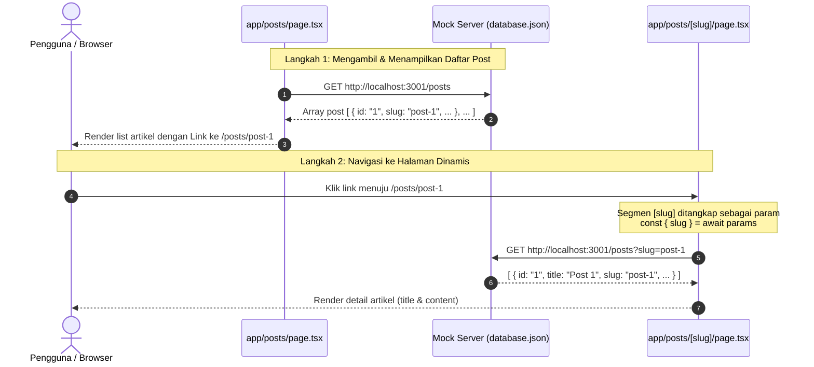

# Cara Kerja Dynamic Route pada Next.js App Router

Dokumentasi ini menjelaskan implementasi dan cara kerja **Dynamic Route** pada fitur posts yang menghubungkan data mock dengan rute dinamis di Next.js.

---

## 1. File yang Terlibat

| File | Peran / Tanggung Jawab |
|---|---|
| `database.json` | Mock database yang menyimpan data artikel dengan properti `slug` unik. |
| `app/types/Post.tsx` | Definisi tipe TypeScript `Post` sebagai kontrak struktur data. |
| `app/posts/page.tsx` | Halaman daftar artikel (rute statis `/posts`) yang menghasilkan link dinamis ke setiap artikel. |
| `app/posts/[slug]/page.tsx` | Halaman detail artikel (rute dinamis `/posts/:slug`) yang menangkap parameter `slug` dan menampilkan artikel terkait. |

---

## 2. Diagram Alur (Mermaid.js)

### Flowchart Alur Kerja



### Sequence Diagram Interaksi



---

## 3. Penjelasan Rinci Setiap Tahap

### Tahap 1: Struktur Data & Kontrak Tipe
- **`database.json`** menyimpan item post yang memiliki identifier ramah URL (`slug`):
  ```json
  {
    "id": "1",
    "title": "Post 1",
    "slug": "post-1",
    "content": "Content Post 1"
  }
  ```
- **`app/types/Post.tsx`** mendefinisikan tipe `Post`:
  ```typescript
  export type Post = {
    id: string;
    title: string;
    slug: string;
    content: string;
  };
  ```

### Tahap 2: Pembuatan Link Dinamis (`app/posts/page.tsx`)
- Fungsi `getPosts()` mengambil seluruh daftar post.
- Komponen `PostsPage` mengiterasi setiap item post dan membungkus judulnya dengan komponen `<Link>`:
  ```tsx
  <Link href={`/posts/${post.slug}`}>{post.title}</Link>
  ```
- Ketika post memiliki `slug: "post-1"`, Next.js membuat tag `<a>` yang mengarah ke `/posts/post-1`.

### Tahap 3: Dynamic Segment `[slug]` (`app/posts/[slug]/page.tsx`)
- Tanda kurung siku `[slug]` pada nama folder menandakan kepada Next.js App Router bahwa segmen ini bersifat dinamis.
- Nilai apa pun yang berada di posisi tersebut pada URL (misalnya `post-1`, `post-2`, dsb.) akan ditangkap sebagai properti `slug`.
- Pada Next.js versi 15 ke atas, properti `params` bertipe `Promise`:
  ```tsx
  export default async function PostPage({
    params,
  }: {
    params: Promise<{ slug: string }>;
  }) {
    const { slug } = await params;
    // slug bernilai "post-1" saat URL adalah /posts/post-1
  ```

### Tahap 4: Pengambilan Data Berdasarkan Parameter
- Nilai `slug` yang diekstrak dikirimkan ke fungsi `getPost(slug)`:
  ```typescript
  async function getPost(slug: string): Promise<Post> {
    const response = await fetch('http://localhost:3001/posts?slug=' + slug);
    const [post] = await response.json();
    return post;
  }
  ```
- Server mock memfilter data berdasarkan parameter query `slug`.
- Array hasil respons di-destructure (`const [post] = ...`) untuk mendapatkan item pertama yang cocok.
- Halaman me-render `post.title` dan `post.content`.

---

## 4. Mekanisme Parameter & `console.log()`

### Apakah `[slug]` otomatis masuk ke dalam `params`?
**Ya, otomatis.** Nama yang diletakkan di dalam kurung siku `[...]` pada struktur folder dijadikan *key* dari objek parameter oleh Next.js.

### Aturan Penamaan Folder Dinamis
Next.js memetakan nama *key* sesuai teks di dalam kurung siku:

| Nama Folder | URL yang Diakses | Hasil `await params` |
|---|---|---|
| `app/posts/[slug]/page.tsx` | `/posts/post-1` | `{ slug: 'post-1' }` |
| `app/posts/[id]/page.tsx` | `/posts/123` | `{ id: '123' }` |
| `app/posts/[articleTitle]/page.tsx` | `/posts/halo-dunia` | `{ articleTitle: 'halo-dunia' }` |

### Cara Melihat Hasil via `console.log()`
Pada Next.js App Router (versi 15+ / 16+), properti `params` bertipe **`Promise`**, sehingga wajib menggunakan `await` sebelum nilainya dapat dibaca:

```tsx
// File: app/posts/[slug]/page.tsx

export default async function PostPage({
  params,
}: {
  params: Promise<{ slug: string }>;
}) {
  // 1. Await objek params:
  const resolvedParams = await params;
  console.log(resolvedParams); 
  // Output terminal: { slug: 'post-1' } (jika akses URL /posts/post-1)

  // 2. Atau destructuring langsung:
  const { slug } = await params;
  console.log(slug); 
  // Output terminal: 'post-1'

  ...
}
```

> [!NOTE]
> Karena komponen ini merupakan **Server Component**, output `console.log()` akan dicetak pada **terminal** tempat server Next.js (`pnpm dev`) dijalankan, bukan di browser DevTools.
